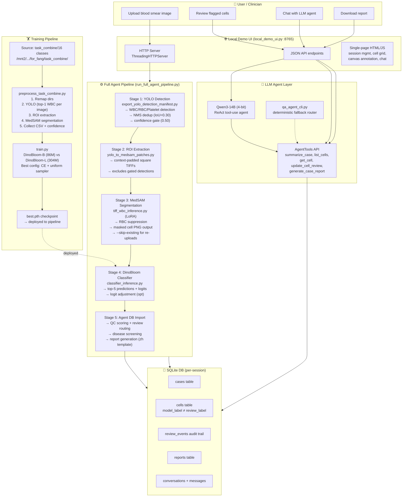
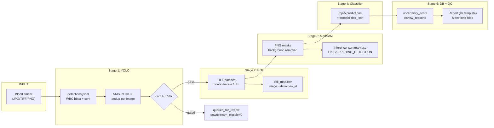

# Full Pipeline User Flow

Date: 2026-06-08 (updated)

## Architecture Overview



## Data Flow Detail



## Session Directory Structure

```text
{output_root}/{session_id}/
├── 01_yolo/
│   ├── detections.jsonl          # all detections (WBC + RBC)
│   ├── images.jsonl              # per-image metadata
│   ├── patches/                  # raw YOLO crops
│   └── per_image_json/           # per-image detection JSON
├── 02_medsam_input/              # ROI TIFFs (WBC only, gated excluded)
├── 03_medsam_output/
│   ├── inference_summary.csv     # MedSAM results
│   └── {category}/{cell_type}/   # masked PNGs
├── 04_classifier/
│   └── classifier_results.json   # top-k predictions
├── cell_map.csv                  # image→detection_id mapping
├── gated_detections.json         # IDs below gate threshold
├── ymca_agent.db                 # SQLite DB for this session
├── agent_pipeline_summary.json   # case summary JSON
└── agent_report.txt              # generated clinical report
```

## UI Architecture

```text
local_demo_ui.py (localhost:8765)
├── GET /                  → Single-page HTML app
├── POST /api/upload       → Upload image(s) → run pipeline → return case JSON
├── GET /api/case/{sid}    → Case summary (cell counts, disease flags)
├── GET /api/cells/{sid}   → Cell list (filterable by label/status/uncertainty)
├── POST /api/cells/{cid}/review → Update review_status/review_label
├── GET /api/report/{sid}  → Generate report (zh template, safety-validated)
├── POST /api/chat         → Qwen agent interaction (tool-use loop, max 4 calls)
└── GET /api/sessions      → List all sessions with DB

Frontend features:
- Session management (create/switch/load)
- Per-session chat logs
- Cell grid with ROI preview + canvas annotation
- Position-on-original-image viewer
- Top probability bars per cell
- YOLO confidence, MedSAM quality, classifier entropy display
- Advanced options: YOLO gate threshold, NMS IoU
- Manual bbox drawing on original image
```

## DB Schema (per-session ymca_agent.db)

| Table | Key Columns | Purpose |
|-------|-------------|---------|
| **cases** | case_id, original_image_path, status | Per-case metadata |
| **cells** | cell_id, case_id, detection_id | Main cell record |
| | yolo_confidence, bbox_xyxy_original, downstream_eligible | YOLO stage data |
| | mask_path, segmentation_status, segmentation_quality | MedSAM stage data |
| | model_label, top_probability, probabilities_json, entropy | Classifier data |
| | review_status, review_label, reviewer_id, reviewed_at | Human review |
| | overlap_score, is_current | QC + versioning |
| **review_events** | cell_id, previous_status, new_status, note | Audit trail |
| **reports** | case_id, content | Generated reports |
| **conversations** | conversation_id | Chat sessions |
| **messages** | conversation_id, role, content | Chat messages |

Key design: `model_label` (immutable ML output) ≠ `review_label` (human correction). `summarize_case()` uses `review_label` when available, falls back to `model_label`.

## QC & Review Routing

```text
review_reasons() flags:
  - low_yolo_confidence        (< 0.3)
  - low_segmentation_quality   (< 0.5)
  - segmentation_suspicious    (status ≠ ok/accepted)
  - low_classifier_probability (top1 < 0.5)
  - small_top1_top2_margin     (< 0.15)
  - high_entropy               (> 1.5)
  - high_bbox_overlap          (overlap_score > 0.5)
  - rare_or_immature_class     (in RARE_CLASSES set)
  - not_downstream_eligible    (gated by YOLO conf)

RARE_CLASSES = {monoblast, myeloblast, apl_suspect, other_immature,
                early_pre_b, pre_b, pro_b, hematogone}
BLAST_LIKE_LABELS = {monoblast, myeloblast, apl_suspect, other_immature}
```

## Report Generation (zh template)

```text
【研究用草稿 — 不作為臨床診斷依據】

一、檢體資訊           ← 留空（醫師手填）
二、臨床資料           ← 留空（醫師手填）
三、檢查結果           ← DB 自動填入：細胞分布計數表
四、綜合判讀           ← DB 自動填入：形態學發現、disease_warnings、待複核數
五、結論/意見          ← DB 自動填入：結論、建議、緊急旗標

Safety validation: prohibited_claims checked with negation-aware matching
```

## Training Pipeline

```text
Source: /mnt2/anita/TechBio/classified/PKG-AML-Cytomorphology_LMU/for_fang/task_combine/
  └── 16 class folders (21,621 images total)

preprocess_task_combine.py:
  Step 1: Remap → {class}/{class}/*.img symlinks
  Step 2: YOLO detection (conf=0.25, batch=32)
  Step 3: ROI extraction (top-1 WBC per image)
  Step 4: MedSAM segmentation (LoRA, suppress-rbc, skip-existing)
  Step 5: Collect CSV (status, mask_path, cell_type, yolo_confidence, yolo_class_label)
           + per-class analysis JSON

Output: task_combine_medsam_summary.csv (~21,497 rows)
        task_combine_class_analysis.json (confidence + MedSAM quality per class)

train.py configs:
  ┌─────────────────────────┬────────┬────────┬─────────┬──────────┐
  │ Config                  │ Model  │ Loss   │ Sampler │ Batch    │
  ├─────────────────────────┼────────┼────────┼─────────┼──────────┤
  │ dinobloom_ce_uniform    │ B 86M  │ CE     │ uniform │ 32       │
  │ dinobloom_l_ce_uniform  │ L 304M │ CE     │ uniform │ 16       │
  └─────────────────────────┴────────┴────────┴─────────┴──────────┘

  Best result (B): macro_F1 = 0.8356

Checkpoints:
  DinoBloom-B: artifacts/checkpoints/dinobloom/DinoBloom-B.pth (504 MB)
  DinoBloom-L: artifacts/checkpoints/dinobloom/DinoBloom-L.pth (1.2 GB)
  Trained:     artifacts/checkpoints/convnet/task_combine_dinobloom/best.pth

Deployment: --classifier-ckpt flag on local_demo_ui.py or run_full_agent_pipeline.py
```

## LLM Agent Integration

```text
Qwen3-14B (4-bit quantized, local GPU)
├── Mode: ReAct tool-use (system prompt + tool schemas)
├── Tools: summarize_case, list_cells, list_uncertain_cells,
│          get_cell, update_cell_review, generate_case_report
├── Max tool calls: 4 per user message
├── Context: conversation history + active case_id from DB
└── Fallback: qa_agent_cli.py deterministic intent router

Agent can:
  - 回答 case summary 問題
  - 列出/篩選 cells（by label, uncertainty, review status）
  - 接受/更正/排除/標記無法分類 cells
  - 生成結構化中文報告
  - 解釋 QC flags 和 disease warnings
```

## Quick Start

```bash
# Start server
conda run -n techbio python scripts/local_demo_ui.py \
  --agent-mode qwen \
  --qwen-model-path models/qwen/Qwen3-14B \
  --qwen-load-in-4bit \
  --port 8765

# Training (after preprocessing)
cd techbio_final-project/checkpoints_classifier
python preprocess_task_combine.py                    # YOLO → MedSAM → CSV
python run_all_configs.py --summary-csv task_combine_medsam_summary.csv  # train B + L
```
